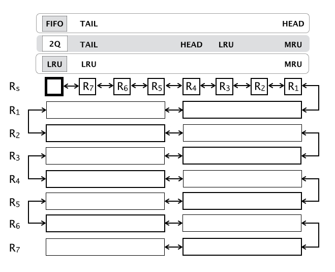

#cache line container

---

---

####`stat`

    stardate          dec 13 2015
    design            completed
    specification     wip
    documentation     wip
    libclc   (C)      wip - pending alpha.0 release
    libclc-g (go)     wip - pending alpha.0 release
    libclc-j (Java)   tbd 

####`about`

[TODO spec and lang-invariant doc]

####`ref-impl`

* [C11](https://github.com/alphazero/libclc)
* [Go](https://github.com/alphazero/libclc-go)
